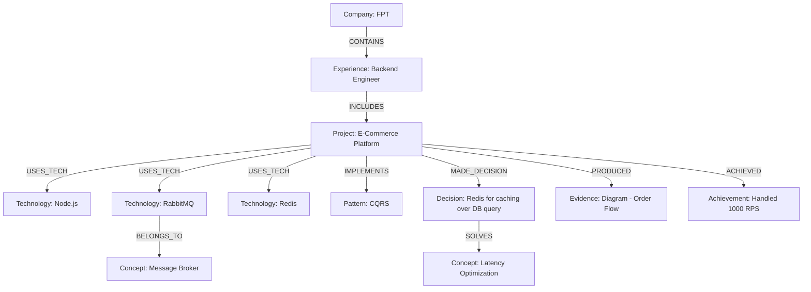

# Knowledge Graph Ontology for Career OS

## 1. Node Types
Hệ thống sử dụng các loại Node sau để lưu trữ thông tin:
- **`Technology`**: Ngôn ngữ, framework, database, tool (VD: Node.js, Next.js, Redis, RabbitMQ).
- **`Concept`**: Khái niệm kỹ thuật (VD: Microservices, Event-driven, RAG, Vector Search).
- **`Pattern`**: Các pattern thiết kế phần mềm (VD: MVC, Singleton, Retry, Rate Limiting).
- **`Project`**: Các dự án đã làm (VD: E-Commerce, GraphRAG-Code).
- **`Experience`**: Các giai đoạn làm việc (VD: FPT Software, Personal).
- **`Company`**: Các tổ chức, công ty (VD: FPT).
- **`Decision`**: Các quyết định kỹ thuật quan trọng (VD: Why PostgreSQL over MongoDB).
- **`Evidence`**: Dữ liệu chứng minh (VD: Benchmark report, PR link, Architecture Diagram).
- **`Achievement`**: Các thành tựu định lượng (VD: Giảm 50% latency).
- **`Research`**: Nghiên cứu, khóa luận (VD: Capstone Project).

## 2. Edge Types (Relations)
Các liên kết (Edges) thể hiện cách các Node tương tác với nhau trong sự nghiệp.

### Structural Relations
- `[Company] -CONTAINS-> [Experience]`
- `[Experience] -INCLUDES-> [Project]`

### Technical Relations
- `[Project] -USES_TECH-> [Technology]`
- `[Project] -IMPLEMENTS-> [Pattern]`
- `[Project] -APPLIES-> [Concept]`
- `[Experience] -USES_TECH-> [Technology]`

### Justification & Proof
- `[Project] -MADE_DECISION-> [Decision]`
- `[Decision] -SOLVES-> [Concept/Pattern]`
- `[Project] -PRODUCED-> [Evidence]`
- `[Project] -ACHIEVED-> [Achievement]`

### Inter-Technology / Inter-Concept
- `[Technology] -BELONGS_TO-> [Concept]` (VD: RabbitMQ -> Message Broker)
- `[Concept] -RELATED_TO-> [Pattern]` (VD: Distributed Systems -> Saga Pattern)
- `[Technology] -INTEGRATES_WITH-> [Technology]` (VD: Next.js -> TailwindCSS)

## 3. Example Graph (E-Commerce at FPT)

